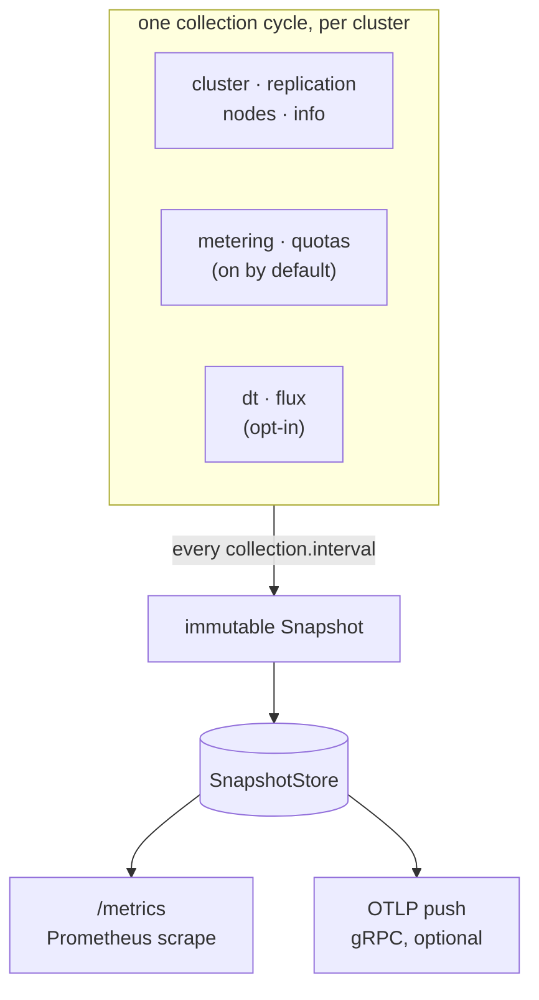

# obs_exporter

The release badge is served live by shields.io from the GitHub releases API, so
this page states the current version without anyone editing it. The version of
the binary you are actually running is in `obs_exporter_build_info{version}`.

Prometheus + OTLP exporter for **Dell EMC ECS / ObjectScale** object-storage
clusters. The metric surface was built against the ObjectScale **4.1.0.0**
management REST API reference and is compatible with the ECS 3.x dashboard API
it extends; where a live **4.3** cluster contradicted that reference the code
follows the cluster, and the opt-in Flux collector targets 4.3 sources the
dashboard API does not serve. See [ADR-0008](adr/0008-swagger-4.2-validation-findings.md)
and [ADR-0011](adr/0011-flux-collector-for-unreachable-metrics.md).

## How it works

A single exporter process polls every configured cluster on a fixed interval and
publishes an immutable snapshot. Both export paths read that snapshot — Prometheus
scrapes never hit the ECS API directly, and backend load is independent of how
many Prometheus servers scrape you.

## Highlights

- **Multi-cluster**: one process, many clusters; every series carries a `cluster` label.
- **Dual export**: Prometheus `/metrics` plus optional OTLP gRPC push.
- **Bulk where the API allows it**: namespace billing is one POST per cycle
  instead of one GET per namespace; per-node dashboard stats and
  replication-group RPO lag come from documented 4.1 endpoints.
- **Reaches what the REST API cannot**: an opt-in collector queries the cluster's
  Flux monitoring store for per-node CPU, memory and network and cluster-wide
  directory-table counters — fields the 4.3 dashboard payloads simply omit. Same
  port, same session, no extra network access.
- **Graceful degradation**: a failing cluster or collector yields `ecs_up=0` /
  `ecs_collector_up=0` instead of breaking the scrape.
- **Hot reload**: SIGHUP or config-file change rebuilds the collection loop without
  dropping `/metrics`.
- **Session hygiene**: ECS caps auth tokens per user; the exporter logs out of every
  cluster on shutdown and re-authenticates on token expiry.

## Where next

**New here?** [Quick start](getting-started/quickstart.md) runs a full demo stack
with no ObjectScale hardware — `make demo` gives you the exporter, Prometheus and
provisioned Grafana dashboards against a fake cluster.

- [Installation](getting-started/installation.md) — binary, container, or package
- [Configuration](getting-started/configuration.md) — the config file and every collector flag
- [Metrics reference](metrics/index.md) — the full catalog

Deploying it:

- [Docker](deployment/docker.md) · [Kubernetes](deployment/kubernetes.md) · [systemd](deployment/systemd.md)

Upgrading from an older major: [from v1](migration-v2.md) and
[to v3](migration-v3.md) — both are breaking changes with old→new metric tables.
