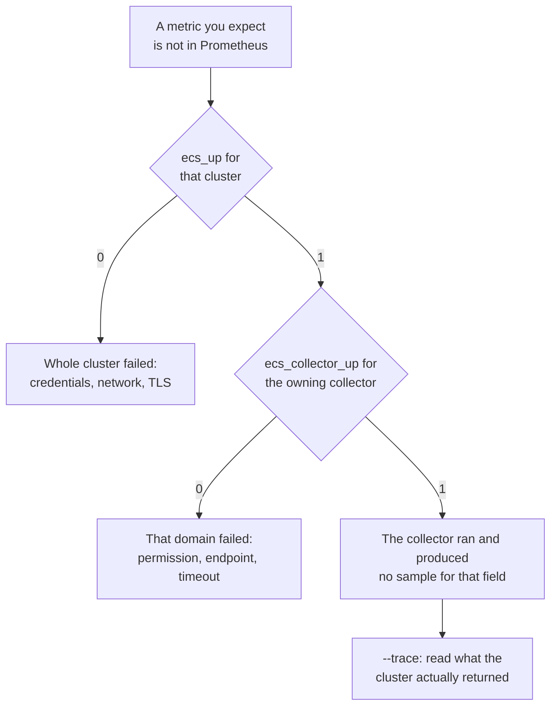

# Verify and troubleshoot

This page covers two jobs that use the same small set of tools: confirming that
a newly configured cluster is being collected correctly, and working out why a
metric you expect is not there. Both come down to three command-line flags and
one HTTP endpoint.

If you arrived here mid-incident, go straight to the [symptom
index](#symptom-index). If you have a few minutes, read the next section first —
this exporter fails in a way most exporters do not, and knowing that turns most
"the panel is empty" investigations into a five-minute job.

## Read this first: a missing metric, not a wrong one

The exporter never guesses a value. Every number it publishes was read out of a
payload the cluster actually returned and parsed cleanly as a number. When a
field is absent from the response, arrives as `N/A` or an empty string, or
arrives in a shape the collector does not recognise, the exporter emits **no
sample at all** for that metric on that cycle. It does not emit a zero, and it
does not carry the previous cycle's value forward.

That is a deliberate design rule, recorded in
[ADR-0007](../adr/0007-obs-4-1-api-alignment.md). The reasoning is that these
metrics are published as gauges holding a current reading, and once a value
reaches Prometheus there is nothing left in it to say where it came from. A
fabricated zero for "capacity we could not read" is indistinguishable from a
real zero, so it does not just lose information — it invents a fact, and it will
eventually fire an alert or clear one that should have fired. An absent sample
is honest: it says nothing, which is exactly what the exporter knows.

The cost of that honesty is that a failure is quiet. Prometheus stores nothing
for a metric that was never exposed, a Grafana panel querying it draws an empty
graph rather than a flat line at zero, and — this is the part that catches
people — the exporter's log may say nothing at all, because from the collector's
point of view nothing went wrong. It asked for a payload, got one, read the
fields it recognised, and published them.

This is the opposite of what you get from exporters that emit a zero when a read
fails, and it is the most likely reason you are reading this page: a panel is
blank, `ecs_up` is 1, every `ecs_collector_up` is 1, and nothing in the logs
explains the gap. [Absent, never zero](../metrics/reading.md#absent-never-zero)
makes the same point from the other end — what an empty panel means when you are
reading dashboards rather than debugging one.

When that happens there are exactly two possibilities, and from outside the
exporter they look identical:

1. **The cluster does not report that field.** Real and common. ObjectScale 4.3
   dashboard payloads simply omit several fields the 4.1 API reference
   documents — per-node CPU and memory, the NIC counters, the cluster-wide
   transaction fields. The metrics reference marks these as
   [availability caveats](../metrics/index.md), and the opt-in
   [Flux collector](../metrics/flux.md) exists specifically to read some of them
   from another source on the same cluster.
2. **The cluster reported it and the exporter could not read what it sent.** A
   value key the parser does not expect, a number encoded in a way it rejects, a
   list keyed differently from the reference examples. This has happened before:
   real clusters key the node and replication-group arrays `_instances` where
   the reference examples use `instances`.

The first is a fact about your cluster and there is nothing to fix in the
exporter. The second is a bug in the exporter, and it will keep silently costing
you that metric on every cluster of that version until someone reports it. You
cannot tell them apart from the metrics, from the logs, or from the config —
only from the payload the cluster returned. That is what `--trace` prints, and
it is why this exporter ships a trace mode at all.

This is not a hypothetical workflow. It is how the live-cluster evidence in
[ADR-0008](../adr/0008-swagger-4.2-validation-findings.md) was produced: a
contributor ran the exporter against their ObjectScale 4.3 cluster with tracing
on and supplied the sanitised output, 61 requests across all seven endpoints on
a five-node cluster with 54 namespaces. Three suspected bugs were settled by
reading what the cluster actually answered, and two of them would have silently
removed a whole metric family from every deployment had they been real — the
namespace usage metrics in one case, the cluster version and the whole
directory-table collector in the other. None of them was real. No test in the
repository could have shown that either way, because the fake cluster the tests
run against does not check what the exporter asks it for.

## The diagnostic flags

The exporter has four flags in total. `--config` is the one you use in normal
operation; the other three exist for the work on this page.

| Flag | Effect |
| --- | --- |
| `--config PATH` | path to the config file (default `config.yaml`) |
| `--once` | run a single collection cycle, log the result, and exit |
| `--debug` | more verbose logging, and with `--once` also print every collected sample |
| `--trace` | log every management API response body |

`--debug` and `--trace` are independent of each other and of `--once`. Each one
is described below with what it is actually good for.

Every example on this page invokes a local binary, because that is the shortest
form. If your exporter runs as a container, run a second throwaway one with the
same config mounted and put the flags after the image name. Those flags
*replace* the image's default command instead of adding to it, so repeat
`--config` alongside them — that default command is the only thing that points
the exporter at the mounted file:

```bash
docker run --rm -v /etc/obs_exporter/config.yaml:/etc/obs_exporter/config.yaml:ro \
  ghcr.io/fjacquet/obs_exporter:latest \
  --config /etc/obs_exporter/config.yaml --once --debug
```

That is safe to do while the real one is running: `--once` binds no port, so the
two do not collide. Put redirections such as `2>trace.log` on the `docker run`
command rather than trying to write inside the container — the container's output
is the host command's output, so the file lands on the host where you can read
it, and the image is a distroless one running as a non-root user with nowhere
writable to put it anyway. Every later example on this page substitutes the same
way: replace `obs_exporter` with the `docker run …` prefix above and keep the
flags.

### `--once` — does the cluster answer at all

```bash
obs_exporter --config config.yaml --once
```

`--once` runs exactly one collection cycle against every cluster in the config,
logs one line per cluster with the outcome, and exits. It does **not** start the
HTTP server, so there is no `/metrics` to scrape and no port to conflict with an
exporter already running on the same host — you can run it on a production box
while the real service is up.

It is the fastest way to check that a new cluster entry works. Credentials,
hostname resolution, the management port and TLS trust all have to be right
before a single collector can return anything, and a failing run names which of
them was wrong. Use it after every config change, before restarting the service
that serves your dashboards.

The per-cluster summary at the end looks like this:

```text
time="2026-07-31T09:13:02+02:00" level=info msg="collection done" cluster=ecs-prod-01 ok=true samples=128
```

`ok=false` means the cluster produced no usable data this cycle — that is the
same condition that drives `ecs_up` to 0. `samples` is the total sample count
across all collectors, so a sudden drop between two runs is itself a signal.

### `--debug` — see everything that was collected

```bash
obs_exporter --config config.yaml --once --debug
```

`--debug` makes the logging more verbose, and it is worth knowing what that does
and does not add. Per-collector failures are logged as **warnings**, so they show
up at the default level too — you do not need `--debug` to see that the `quotas`
collector failed. What `--debug` adds that you cannot get any other way is this:
combined with `--once`, it prints **every collected sample** to standard output,
sorted, one per line, in the `name{label="value",…} value` form Prometheus uses.

```text
ecs_cluster_disk_space_bytes{cluster="ecs-prod-01",type="allocated"} 4.12316860416e+11
ecs_cluster_disks{cluster="ecs-prod-01",state="good"} 60
ecs_collector_up{cluster="ecs-prod-01",collector="metering"} 1
ecs_up{cluster="ecs-prod-01"} 1
```

That listing is the ground truth for "what does this cluster actually give me".
Diff it against the [metrics reference](../metrics/index.md) to find the names
that are documented but absent on your cluster — which is the starting point for
everything else on this page. Because the output is sorted and stable, diffing
two runs against each other is also useful: it shows exactly which metrics
appeared or vanished between an upgrade, a config change, or a maintenance
window.

The sample dump goes to **standard output** and all logging goes to **standard
error**, so the two are trivially separated by a shell redirect. That is what the
combined run below relies on.

### `--trace` — see what the cluster actually returned

```bash
obs_exporter --config config.yaml --once --trace 2>trace.log
```

`--trace` logs the full response body of every management API call the exporter
makes, with the cluster name, the HTTP method, the URL and the status code. It
is the only way to see the raw payload, and therefore the only way to settle the
two-possibilities question above. Send it to a file — it is far too much output
to read as it scrolls past, and every recipe below greps `trace.log`.

Two things to know before you run it against production:

**The auth token is never logged.** The trace deliberately does not use the HTTP
client library's own debug mode, because that dumps request headers — and the
session token travels in the `X-SDS-AUTH-TOKEN` header. Only the method, the
URL, the status and the response body are logged. The response to `GET /login`
is skipped entirely: it is the one call whose result is a credential, and there
is nothing else in it worth reading.

**Everything else in the payload is real.** Node names, management and data IP
addresses, namespace names, capacity figures, your cluster's topology. No
credential is ever in there, but that is the only guarantee: everything that
describes your estate is. Bear in mind where the output ends up — run under
systemd or a container runtime it goes to the journal, and on most sites the
journal ships to a central log aggregator that a much wider audience can read
than you intended when you turned the flag on. Redirecting to a file, as above,
keeps it on the one host. See [sharing a trace](#sharing-a-trace-safely) before
it goes anywhere further.

The output is verbose — one full JSON body per API call, several calls per
collector, every cycle. Pair it with `--once` so it stops after a single pass.
Tracing logs at info level, so it works with or without `--debug`.

Note that the trace shows **responses**, not requests. If a collector sends a
request body — the bulk namespace billing call and every Flux query do — the
trace shows what came back, not what was asked. The status code is usually
enough to tell whether the request itself was accepted.

Each traced call is written as a **single log line**, with the response body
JSON-escaped inside the message and the identifying fields at the end:

```text
time="2026-07-31T09:13:02+02:00" level=info msg="API trace:\n{\n    \"title\": \"nodes List\",\n …}" cluster=ecs-prod-01 method=GET status=200 url="https://ecs01.example.com:4443/dashboard/zones/localzone/nodes"
```

One line per call means `grep` on the path gives you the whole record, payload
included. Undo the escaping to read it:

```bash
grep 'localzone/nodes' trace.log | sed 's/\\n/\n/g; s/\\"/"/g'
```

### The combined run: one command, two artefacts

This is the invocation to use when you are validating a cluster properly, and
the one to run if a maintainer asks you for diagnostics:

```bash
obs_exporter --config config.yaml --once --debug --trace 2>trace.log | sort > samples.txt
# samples.txt  → every metric collected (compare with the metrics reference)
# trace.log    → raw API payloads for anything missing or suspicious
```

The redirect sends logging and the trace to `trace.log` while the sample dump
goes down the pipe into `samples.txt`. The `sort` is belt and braces — the dump
is already sorted — and keeps the file stable enough to diff against a later
run.

Work in that order. Read `samples.txt` first and list what is missing against
the reference; only then go into `trace.log` and search for the endpoint that
should have carried it. Doing it the other way round means reading several
megabytes of JSON without knowing what you are looking for.

## Checking health without scraping

The exporter serves `/health` alongside `/metrics`. It answers JSON describing
every configured cluster, and it sets the HTTP status code so that something
which cannot read JSON — a container health check, a load balancer, a monitoring
probe — still gets a usable answer:

```bash
curl -s -o /dev/null -w '%{http_code}\n' localhost:9438/health
curl -s localhost:9438/health | jq
```

```json
{
  "built_at": "2026-07-31T09:14:02Z",
  "clusters": [
    { "cluster": "ecs-prod-01", "ok": true,  "last_scrape": "2026-07-31T09:14:02Z" },
    { "cluster": "ecs-dr-02",   "ok": false, "last_scrape": "2026-07-31T09:14:02Z",
      "err": "all 6 collectors failed: login GET: status 401" }
  ]
}
```

The status code is **200 only when every configured cluster is healthy**, and
**503 as soon as any one of them is not**. That is the right behaviour for a
container health check on a single-cluster deployment and the wrong one for a
multi-cluster deployment, where losing one of five clusters is a degraded
service, not a dead one — the exporter keeps serving every healthy cluster's
metrics regardless of what `/health` reports. If you run several clusters from
one process, alert on `ecs_up` per cluster and treat `/health` as a coarse
liveness signal, or read the JSON and decide for yourself.

`/health` also answers 503 before the first collection cycle finishes, because at
that point it knows about no clusters at all. The HTTP server deliberately starts
before the first cycle — logging in to every cluster and polling it can take
longer than a scrape timeout, and a blocked `/metrics` looks like a dead process
— so there is a real window at startup where `/metrics` answers with only
`obs_exporter_build_info` and `/health` answers 503. Give a container health
check a start period long enough to cover that first cycle. Its length is
bounded by `collection.timeout` (60 seconds by default), not by
`collection.interval`: clusters are polled in parallel, and the timeout is the
per-cluster budget within one cycle.

The path `/health` is fixed. Only the metrics path is configurable, through
`server.uri` in the config file, so on a deployment that has moved `/metrics`
elsewhere `/health` has not moved with it.

## Symptom index



| Symptom | Jump to |
| --- | --- |
| A metric is missing entirely | [below](#a-metric-is-missing-entirely) |
| `ecs_up{cluster="…"} == 0` | [below](#ecs_up-is-0-for-a-cluster) |
| `ecs_collector_up{collector="…"} == 0` while others are 1 | [below](#one-collector-is-0-while-the-others-are-1) |
| `collectFlux` on but no per-node Flux metrics | [below](#collectflux-is-on-but-no-per-node-flux-metrics-appear) |
| `/metrics` returns 503 | [below](#metrics-returns-503) |
| `/metrics` returns 500 | [below](#metrics-returns-500) |

### A metric is missing entirely

**What it means.** The cluster did not report the field, or reported it in a form
the collector could not parse. Either way the exporter published nothing rather
than a zero — see [the first section](#read-this-first-a-missing-metric-not-a-wrong-one)
for why. A missing metric is not an error state; `ecs_up` and every
`ecs_collector_up` can be 1 while a metric is absent.

**What to run.** Two steps, in this order:

```bash
# 1. What DID we collect? Compare against the metrics reference.
obs_exporter --config config.yaml --once --debug | sort > samples.txt
grep '^ecs_node_cpu' samples.txt        # e.g. is it there for any node at all?

# 2. What did the cluster actually send for the endpoint that owns it?
obs_exporter --config config.yaml --once --trace 2>trace.log
grep 'dashboard/zones/localzone/nodes' trace.log | sed 's/\\n/\n/g; s/\\"/"/g'
```

The metrics reference lists the source endpoint for each family at the top of
the page, so step 2 tells you which URL to search for. If the field is simply
not in the JSON, your cluster does not report it and no exporter change will
conjure it — check whether the [Flux collector](../metrics/flux.md) covers it, as
it does for per-node CPU, memory and network on 4.3. If the field **is** in the
JSON and the metric is still absent, that is an exporter bug worth reporting;
see [sharing a trace safely](#sharing-a-trace-safely).

### `ecs_up` is 0 for a cluster

**What it means.** That cluster produced no usable data in the last cycle —
either every collector failed, or the ones that did not fail returned nothing
between them, so the cycle yielded no domain sample at all. In practice it is
almost always credentials, network reachability or TLS trust, because those
three break every collector at once.

**What to run.**

```bash
obs_exporter --config config.yaml --once --debug
```

The failing collectors log a warning each, naming the collector and the
underlying error, and the error names the request that failed:

```text
level=warning msg="collector failed" cluster=ecs-prod-01 collector=cluster err="login GET: status 401"
level=warning msg="collector failed" cluster=ecs-prod-01 collector=nodes err="GET /dashboard/zones/localzone/nodes: status 403"
```

A cluster nothing is listening on is noisier than that, because the HTTP client
retries transport failures twice before giving up and logs each attempt in its
own format, and because every collector tries to log in independently. Read the
first `collector failed` line and ignore the rest — they all say the same thing.

Read the error text before changing anything:

- `login GET: status 401` — the username or password is wrong, or the account is
  locked. Check the secret actually reaching the process, not the one in your
  notes: the exporter reads `${ENV_VAR}` references and `passwordFile` at load
  time, so the value in `config.yaml` may not be the value being sent. See
  [Configuration](../getting-started/configuration.md#secrets).
- `login GET:` followed by a connection or TLS handshake error — the management
  port (4443 by default) is not reachable from this host, or its certificate is
  not trusted by it. The wrapped error names the URL that could not be reached. A
  self-signed cluster certificate needs `insecureSkipVerify: true` on that
  cluster entry, which is a deliberate downgrade — prefer installing the CA.
- `login GET: no X-SDS-AUTH-TOKEN in response` — something answered on the
  management port that is not the ObjectScale management API. Check the host and
  port; a proxy or load balancer in front of the cluster is a common cause.
- `status 403` on a specific path — the account authenticated but lacks rights
  for that endpoint. That would usually leave other collectors working, so
  seeing it on all of them points at a monitoring account with no roles assigned.

One thing not to do: restarting the exporter does not help with any of these.
The client does not retry 4xx responses on purpose, precisely because retrying
an authentication or permission failure only burns cluster sessions. A fresh
process will fail exactly the same way at the same point.

### One collector is 0 while the others are 1

**What it means.** One domain failed and the rest are fine. This is the exporter
degrading per collector by design: a failing collector does not fail the cycle,
does not fail the cluster, and does not fail the scrape. Everything else keeps
being published, which is why `ecs_up` can be 1 while a whole family of metrics
is gone.

**What to run.** The same `--once --debug` run as above; the warning names the
collector. The likely cause depends on which one it is:

- `quotas` — the management API has no bulk quota endpoint, so this collector
  issues one request per namespace. On a large cluster it is the first to hit
  the per-cluster `collection.timeout`. It is also the one most often denied by
  a narrowly scoped monitoring account.
- `flux` — the account is missing the `SYSTEM_MONITOR` or `SYSTEM_ADMIN` role
  the Flux monitoring store requires. Every other collector works with a plain
  monitoring account, so this is the one collector whose failure means "rights",
  not "reachability" — it uses the same port and the same session as the rest.
- `dt` — the opt-in directory-table collector talks to each node's own ports
  (9021 and 9101), not the management port. On the segmented network layout Dell
  recommends for production, port 9101 lives on a private link-local VLAN that an
  external exporter cannot reach at all. See the
  [reachability warning](../metrics/index.md#node-dt-opt-in-collectdt-true).
- `metering` — the bulk billing POST failed or timed out. Disabling
  `collectMetering` also disables `quotas`, which depends on it.

Restarting will not help if the cause is a permission or an unreachable
endpoint. If the collector is one you do not need on this cluster, turning its
flag off in the config is a legitimate fix — it stops the failed reads and, more
usefully, stops `ecs_collector_up` reporting a failure you have decided not to
care about. Do not do that for `quotas` without reading the
[note on clusters with many namespaces](../getting-started/configuration.md#quotas-on-clusters-with-many-namespaces),
which explains when disabling it costs you nothing.

### `collectFlux` is on but no per-node Flux metrics appear

**What it means.** Either the Flux rows arrived and could not be matched to a
node, or the measurement returned no rows at all. These have different causes and
one metric tells them apart.

**What to run.** Check the housekeeping counter first. Look it up wherever you
normally query — the Prometheus expression browser or a Grafana panel — asking
for this:

```promql
ecs_collector_unmapped_nodes{collector="flux"}
```

If you would rather not leave the shell, the same value is in a single-cycle run,
in the sample dump `--debug` produces:

```bash
obs_exporter --config config.yaml --once --debug | grep ecs_collector_unmapped_nodes
```

Either way you get one number per cluster. It is published every cycle,
including as `0`, so a flat zero genuinely means "the mapping is working" rather
than "the metric is missing".

**Above zero** means the monitoring store reported rows for hosts that matched no
node in the `/vdc/nodes` inventory. Those rows were dropped rather than attached
to the wrong node — a series joined to the wrong node is worse than no series,
because nothing downstream can tell it is wrong. The exporter indexes each
inventory node under its node name, that name's short form, its management IP and
its data IP, and matches the Flux `host` tag against all of them, so a mismatch
usually means the monitoring store knows the nodes by an identifier the
management API does not publish. Run with `--trace` and compare the `host` tag
values in the Flux responses against the `nodename`, `mgmt_ip` and `data_ip`
values in the `/vdc/nodes` response. Both are in the same trace file.

**Exactly zero, with per-node Flux metrics still absent,** means the queries came
back empty. Each empty measurement logs a warning naming the bucket and the
measurement it asked for:

```text
level=warning msg="Flux measurement returned no rows; its samples are absent this cycle" bucket=monitoring_op cluster=ecs-prod-01 measurement=mem
```

That is the signature of a cluster whose measurement names differ from the ones
this collector queries. It matters more than it looks, because enabling
`collectFlux` makes it the sole source of `ecs_node_cpu_utilization_percent`,
`ecs_node_memory_utilization_percent` and `ecs_node_memory_used_bytes` — the
dashboard-based node collector stops emitting those three, and an empty Flux
result does not fall back to it. On a cluster that still serves those fields in
its dashboard payload, enabling Flux can therefore lose you metrics you had. The
[Flux collector page](../metrics/flux.md) explains why that trade is deliberate;
the practical advice is to check those three names are still present after you
turn the flag on.

### `/metrics` returns 503

**What it means.** You are probing `/health`, not `/metrics`. It is an easy
mistake to make through a proxy or a health-check configuration that rewrites the
path, and the two endpoints disagree by design: `/health` answers 503 while any
single configured cluster is failing, whereas `/metrics` keeps answering 200 with
whatever it has, including `ecs_up 0` for the cluster that is down.

`/metrics` itself has no failure mode that produces a 503. A cluster that is
completely unreachable still yields a 200 with `ecs_up{cluster="…"} 0` in the
body, because a scrape reads the last stored collection result rather than
triggering a fresh call to the cluster — nothing a cluster does can fail a
scrape. That is why you should alert on `ecs_up` rather than on scrape failure:
scrape failure means the exporter is gone, not that a cluster is.

**What to run.**

```bash
curl -s -o /dev/null -w '%{http_code} %{url_effective}\n' localhost:9438/metrics
curl -s localhost:9438/health | jq '.clusters[] | select(.ok == false)'
```

If the first prints 200 and the second prints a cluster, your probe is hitting
`/health`. Fix the probe, or fix the cluster it is complaining about. Remember
that `/metrics` may have been moved by `server.uri` while `/health` has not.

### `/metrics` returns 500

**What it means.** Two samples reached the Prometheus registry with the same
metric name *and* the same label values, and the registry rejects that. Because
the endpoint gathers everything in one pass, a single duplicate series fails the
whole response — for every cluster, not just the one that produced it.

**This should not happen.** Since 3.2.0 the collector drops the second and later
occurrence of an identical name-plus-labels within a scrape, so one bad series
costs one series instead of the entire endpoint. If you are seeing a 500 from
`/metrics` on 3.2.0 or later, it is a bug and worth reporting.

**What to run.** Capture the state that produced it, so the report is actionable:

```bash
curl -s -o /dev/null -w '%{http_code}\n' localhost:9438/metrics
obs_exporter --config config.yaml --once --debug | sort > samples.txt
# look for a name+labels appearing twice
awk '{ print $1 }' samples.txt | uniq -d
```

Include `samples.txt`, the exporter version and which collectors are enabled in
the report. The duplicate is far more interesting than the 500: it means some
collector produced two rows for one identity, which points at a query that
dropped a dimension without aggregating it.

## Sharing a trace safely

A trace is the single most useful thing you can attach to a bug report about
this exporter, and it is also a dump of your storage estate. Before it leaves
your network, know what is in it.

### What a trace contains

Every response body from every management API call: node names and their
management and data IP addresses, namespace names (which in most estates are
tenant, project or department names), replication-group topology and the names of
the remote sites in it, raw capacity and usage figures, the ObjectScale software
version and build, and — with `collectDT` or `collectFlux` enabled — internal
service and measurement names from the cluster's own monitoring.

What it does not contain is credentials. The session token travels in a header
and headers are never logged, and the response to `GET /login` is skipped
outright. You do not need to hunt for a leaked token; you do need to deal with
everything else.

### What to strip, and what must survive

The rule that makes sanitising useful rather than destructive: **replace each
identifier consistently**. The same node must map to the same replacement string
in every payload, every endpoint and every line of the file. A trace is
diagnosable because the reader can follow one node from the inventory response
into the dashboard response into the Flux response. Break that thread and the
file is no longer evidence of anything — the reader can see that five nodes
exist and nothing about which of them the problem is on.

That rules out the obvious approach. A blanket regular expression that turns
every IP address into `x.x.x.x`, or every hostname into `REDACTED`, collapses all
five nodes into one string and destroys exactly the relationship the trace exists
to show. So does anything that maps two different real values onto one
replacement — beware of shortcuts like "keep the last octet", which quietly
merges `10.42.7.11` and `10.99.3.11` into the same fake address.

Build a substitution table instead, one line per real identifier, and apply it to
the whole file:

```bash
cat > redact.sed <<'SED'
s/ecs01\.storage\.example\.com/cluster-a/g
s/node-alpha\.storage\.example\.com/node-1/g
s/node-beta\.storage\.example\.com/node-2/g
s/10\.42\.7\.11/192.0.2.11/g
s/10\.42\.7\.12/192.0.2.12/g
s/finance-archive/namespace-1/g
s/hr-backups/namespace-2/g
SED
sed -f redact.sed trace.log > trace.redacted.log
```

Then prove it worked, because a missed identifier is the failure mode that
matters here:

```bash
grep -niE 'storage\.example\.com|10\.42\.|finance|hr-' trace.redacted.log
```

That command should print nothing. Build the pattern from your own real domain,
your real management subnets and a few of your real namespace names, and read the
first few hundred lines of the redacted file by eye before sending it. Node
counts, namespace counts, capacity figures and version strings are all things you
may reasonably choose to keep — they are usually not sensitive, and the capacity
and count figures are frequently the thing being diagnosed.

If the payload is too sensitive to sanitise at all, a single response body for
the one endpoint that is failing is far better than nothing, and it is a much
smaller thing to review by hand than a whole trace.

### What a maintainer actually needs

A useful report is four things, and one command gives you the first two:

```bash
curl -s localhost:9438/metrics | grep -E '^(obs_exporter_build_info|ecs_cluster_info)'
```

```text
obs_exporter_build_info{goversion="go1.26.4",version="3.2.0"} 1
ecs_cluster_info{cluster="ecs-prod-01",version="4.3.0.0.142978.ab620a08b0b8"} 1
```

1. **The exporter version**, from `obs_exporter_build_info{version}`. Take it
   from the running process rather than from your deployment manifest — the
   version label is what the binary actually is.
2. **The ObjectScale version**, from `ecs_cluster_info{version}`. Nearly every
   payload-shape question in this project's history has turned out to be
   version-specific, so this is the first thing anyone will ask for.
3. **The failing endpoint** — the method and path from the trace line, not just
   the metric name. The metrics reference maps families to source endpoints if
   you need to work backwards.
4. **The payload the collector received** for that endpoint, sanitised as above.
   This is the actual evidence; the other three tell the reader how to interpret
   it.

Add which collector flags are enabled on that cluster (`collectMetering`,
`collectQuotas`, `collectDT`, `collectFlux`) and, if you have it, the
`samples.txt` from a `--once --debug` run. Report it on the
[issue tracker](https://github.com/fjacquet/obs_exporter/issues).
